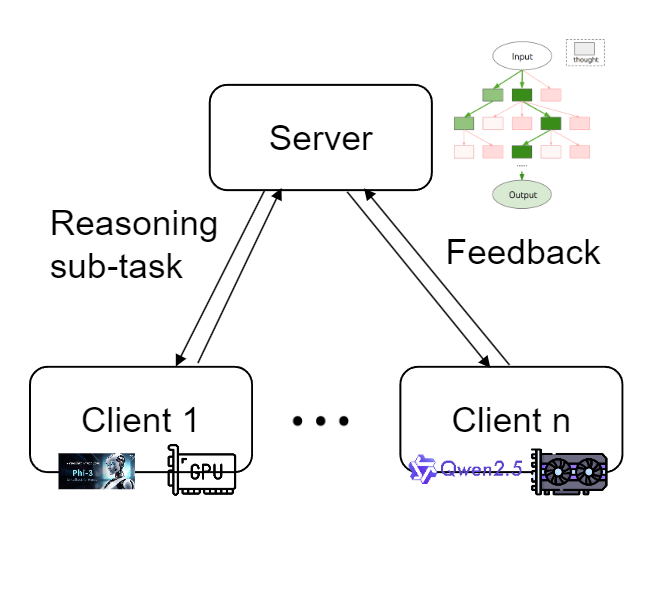

# Federated Monte Carlo Tree Search for Large Language Model Inference

    
    
    

## Introduction

### Acknowledgment

This repository is based on the foundation of [Tree of Thoughts: Deliberate Problem Solving with Large Language Models](https://proceedings.neurips.cc/paper_files/paper/2023/file/271db9922b8d1f4dd7aaef84ed5ac703-Paper-Conference.pdf), whose official repository is [https://github.com/princeton-nlp/tree-of-thought-llm](https://github.com/princeton-nlp/tree-of-thought-llm). Thanks for their high-quality codes!

### Demo

A demo for this work is comming soon.

### Background

Yao et al.'s work demonstrates the potential of the Monte Carlo Search Tree (MCST) method in solving problems like 24-point, crossword puzzles, and creative writing. This method achieves remarkable results in tasks requiring deep thought by exploring multiple reasoning paths and evaluating them with the model. They propose a reasoning framework called Tree-of-Thought (ToT), which decomposes problems into intermediate steps ("thoughts"), generates multiple possible solutions at each step, screens out the most promising paths through self-evaluation, and combines strategies like breadth-first search (BFS) or depth-first search (DFS) for systematic exploration and backtracking. This helps language models find optimal solutions to complex problems and significantly enhances their reasoning and planning abilities.

While the MCTS method has made significant progress in tasks like 24-point that require deep thought, it is computationally expensive because it needs to generate and evaluate multiple thoughts. For example, solving a 24-point task with GPT-4o alone consumes thousands to tens of thousands of tokens. Moreover, when using smaller models, the accuracy of the MCTS method drops significantly, similar to the Chain-of-Thought (CoT) method. In CoT reasoning, smaller models have weaker generation capabilities and struggle to produce diverse and high-quality intermediate steps. In the MCTS method, smaller models also face limitations in evaluation capabilities, making it difficult to achieve usable performance.

To address these issues, we propose the Federated MCTS method, a plug-and-play reasoning framework that supports joint reasoning by models of different scales. We noticed that the insufficient evaluation capabilities of smaller models are particularly prominent in the MCTS method, limiting their further application in MCTS. With our method, we achieved accuracy comparable to pure large models in the 24-point task while significantly reducing costs compared to pure large models. Specifically, we made the following modifications:

- **Rule-enhanced Evaluation**: During evaluation, we assist the process with rules. We summarized some cases that can obviously complete 24-point, such as 1, 1, 1, 24 or 1, 1, 1, 8. When these cases are matched, they are assigned higher evaluation scores.

- **Format Verification**: To ensure the accuracy of evaluation, we verify the thought format during generation, ensuring that all thoughts entering the evaluation have the correct format. During the generation phase, if a thought does not have the correct format, it will be discarded.

- **Prompt Learning**: We adopted a different Prompt from the original ToT method, which significantly improved the accuracy.

- **Federated Reasoning**: Federated Reasoning: We adopt a federated reasoning approach, which allows one or multiple distinct models to collaboratively participate in the reasoning process for the same task.

## Method

## Expriments

## Results

## Usage

This part will comming soon.

## Small Talk